<p align="center">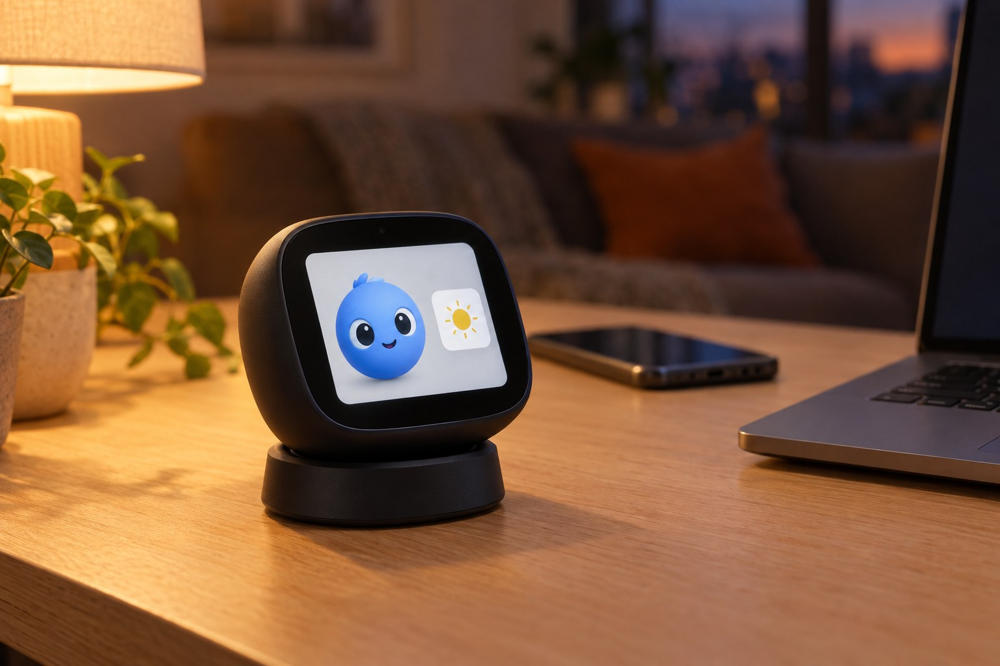</p>
<p align="center"><sub>An impression, not a photo: made with an image model on 7 October 2026 (the prompt and the model are in <a href="docs/hero/hero.openai.txt">docs/hero/hero.openai.txt</a>). The real ESP32-S3-BOX-3 is squarer. Everything else on this page is rendered from the code.</sub></p>

# Muse ESP32-S3-BOX-3 Screen

> **Try it in the browser:** [muse-web-screen.vercel.app](https://muse-web-screen.vercel.app), the same cards and scenes as the box, in demo mode or connected to your Home Assistant.
>
> **Read the story behind it:** [An always-on AI agent needs a body in the house](https://blog.leopardcode.ai/en/esp32-box-as-the-body-of-an-always-on-agent/) (English) · [Ein KI-Agent, der immer da ist, braucht einen Körper im Haus](https://blog.leopardcode.ai/de/esp32-box-as-the-body-of-an-always-on-agent/) (Deutsch), on blog.leopardcode.ai.

One assistant, many hands. An Espressif ESP32-S3-BOX-3 (a 2.4 inch touch screen, two microphones, a speaker, and a dock with radar, climate sensor and battery) becomes the face, voice and ears of an AI assistant in the house. The assistant draws the screen itself in a small drawing language, asks back with buttons, counts timers, shows routes on OpenStreetMap, GIFs, photos and live cameras, hears its wake word on the device and talks through Home Assistant's voice pipeline. Built with ESPHome and Home Assistant, driven by Meta's Muse, by Claude, or by any agent that can call an API.

The whole thing is one ESPHome configuration, five C++ headers and a handful of tools. Everything that differs from house to house is a substitution or a secret.

> **Status, 8 October 2026:** firmware 4.1.0 runs on one ESP32-S3-BOX-3 (4.2.0 changes only the names) with the BOX-3-SENSOR dock, built with ESPHome 2026.9.1 on ESP-IDF 5.5.5 and confirmed with Home Assistant 2026.9.4. Flash 95 % of the 8 MB app partition, RAM 49 % of the 342 KB of static RAM, no compiler warning from this project's own code, no warning in the box's log after boot. What changed when: [CHANGELOG.md](CHANGELOG.md). Every number in this file was measured on that box; the sources at the end carry the rest.

## Contents

- [What it does](#what-it-does)
- [The screen in pictures](#the-screen-in-pictures)
- [How it fits together](#how-it-fits-together)
- [Who talks to it](#who-talks-to-it)
- [Hardware](#hardware)
- [Quick start](#quick-start)
- [Flash it with Claude Code](#flash-it-with-claude-code)
- [Make it yours](#make-it-yours)
- [Actions](#actions)
- [Scenes: the drawing language](#scenes-the-drawing-language)
- [Touch, buttons and the status bar](#touch-buttons-and-the-status-bar)
- [Entities in Home Assistant](#entities-in-home-assistant)
- [Pictures, GIFs, live views, routes and music](#pictures-gifs-live-views-routes-and-music)
- [Performance, measured](#performance-measured)
- [Privacy and security](#privacy-and-security)
- [Troubleshooting](#troubleshooting)
- [FAQ](#faq)
- [Repository layout](#repository-layout)
- [Development](#development)
- [What Meta's own SDK does differently](#what-metas-own-sdk-does-differently)
- [Comparable projects](#comparable-projects)
- [Licence and third-party work](#licence-and-third-party-work)
- [Sources](#sources)

## What it does

- **Shows what the assistant says.** Text, a value with a unit, the weather with an animated icon, an event from the house, a photo, a GIF, a live camera view, a route on a map, the day's appointments, a list with ticks, a timer, a celebration with confetti. Each is one Home Assistant action with two to four fields ([docs/ACTIONS.md](docs/ACTIONS.md)).
- **Lets the assistant draw.** `muse_draw` takes a scene in a drawing language of its own: shapes, gradients, text in six sizes, 273 icons, its figure, particles, frames, motion. The box answers with what it did not understand, line by line, with the closest valid word ([docs/SCENES.md](docs/SCENES.md)).
- **Asks back.** Yes or no, or up to four choices as buttons under the finger; the answer lands in a Home Assistant sensor and in the action's response, so an agent can wait for it (`muse_ask`, `muse_choose`, `muse_wait_answer`). Scenes can carry buttons too.
- **Listens.** The wake word (microWakeWord's `hey_jarvis`, shown as "Muse") runs on the box; the conversation goes through Home Assistant's Assist pipeline, local or cloud, as you set it up. A long press on the ready screen starts it without the wake word.
- **Counts timers.** "Timer five minutes" by voice, or `muse_show_timer` from an agent: a ring on screen, the remaining time in the status bar when another card is up, a chime and a card when it ends.
- **Queues cards.** A new card waits while another is on screen, up to twelve; a question, the doorbell and a voice conversation go first. A tap moves on, a swipe goes back, a long press clears everything.
- **Feels the room.** The dock's 24 GHz radar reports presence (held for 30 s, the figure waves once when someone arrives), the AHT20 reports temperature and humidity, corrected for the warm board. At night with nobody there the display can go dark (a switch, off by default).
- **Plays sound.** Voice replies, the chime, a sound when a question appears, and anything Home Assistant or Music Assistant sends to its media player, Spotify included.
- **Runs on a Mac as well.** Muse Web Screen, live at [muse-web-screen.vercel.app](https://muse-web-screen.vercel.app) (a demo opens without any setup), is the box's twin in the browser ([`web/`](web/); as a borderless, always-on-top app on your Mac: [docs/MAC_APP.md](docs/MAC_APP.md)): the same cards and scenes drawn on a 320 x 240 canvas with the same parser, fonts, timings and particles, fed by the same Home Assistant actions (it listens to the box's `call_service` events, or to a `muse_web` event of its own), installable as a Dock app in Chrome or Safari and floating above every other window as a Picture-in-Picture display. Plain ES modules without a build step; `index.html?demo=1` shows everything without Home Assistant ([web/README.md](web/README.md)).
- **Keeps the house in the house.** Home Assistant and the box talk on the LAN over an encrypted API. Only pictures from the web, routes (OpenStreetMap) and music streams leave; nothing is sent to anyone else ([docs/PRIVACY.md](docs/PRIVACY.md)).

## The screen in pictures

<p align="center">
  
  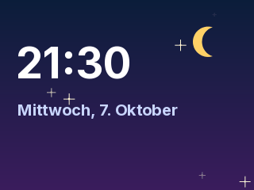
</p>

Every picture below was rendered from the scene files in [`scenes/`](scenes/) by [`tools/render_scene.py`](tools/render_scene.py), a host port of the box's parser and renderer, with the figure frames that ship in this repository (the same files the box embeds). The same files sent to a box give the same picture, pixel by pixel within the limits the tool documents (anti-aliasing and RGB565 aside). A changed scene changes its preview, so these cannot drift from the firmware.

| | | |
|---|---|---|
|  | 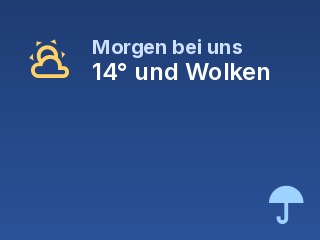 | 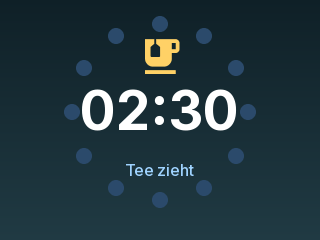 |
| `scenes/welcome.txt` | `scenes/weather.txt` | `scenes/ring.txt` |
| 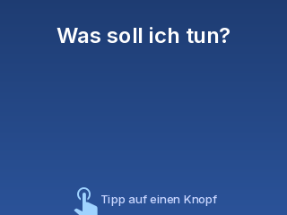 | 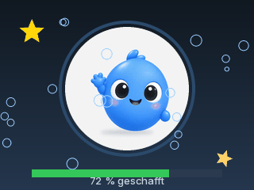 | 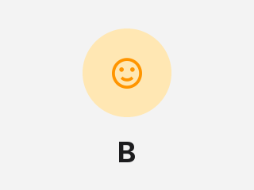 |
| `scenes/menu.txt` | `scenes/progress.txt` | `scenes/wink.txt` |

**The cards**, as the web twin draws them (each is one action, see [Actions](#actions)):

<p align="center">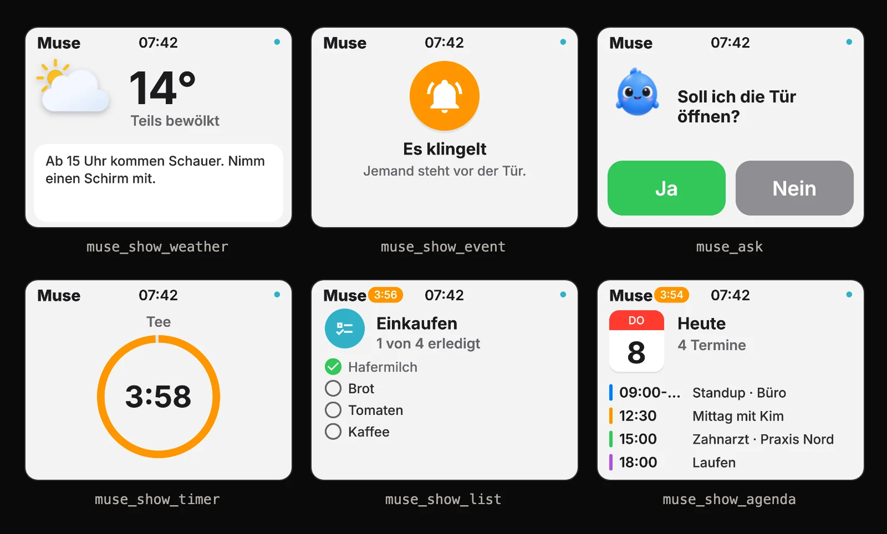</p>

**On a Mac**, Muse Web Screen runs as an app window next to everything else and can float above it ([web/](web/), demo at [muse-web-screen.vercel.app](https://muse-web-screen.vercel.app)):

<p align="center"></p>
<p align="center">How to set it up as an app with your own figure and icon, borderless and on top: <a href="docs/MAC_APP.md">docs/MAC_APP.md</a>.</p>
<p align="center">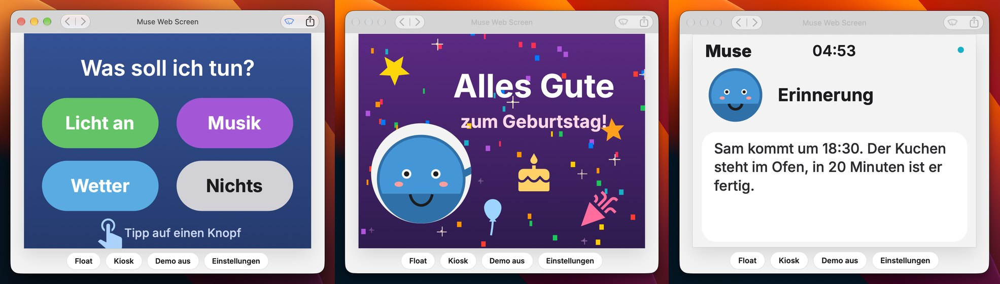</p>
<p align="center"><sub>Screenshots of 8 October 2026, 04:53; tab titles and bookmarks blurred. Two areas were set in afterwards: the display, rendered again with the project's current figure by Muse Web Screen itself (same scene, same card, clock fixed to 04:53), and the GitHub page in the browser window, captured after the repository was renamed to muse-esp32-s3-box-3-screen; everything around them is the original screenshot. Meta's Muse artwork is not part of this repository; on your own Mac you can show your own frames (web/README.md).</sub></p>

What the renderer cannot show is the box itself: a real one shows Meta's Muse figure if you own the Muse app (see [Make it yours](#make-it-yours)), the photos and live views of your own cameras, and the voice. Photos of the box in a real house are welcome as pull requests to `docs/photos/`.

## How it fits together

<p align="center">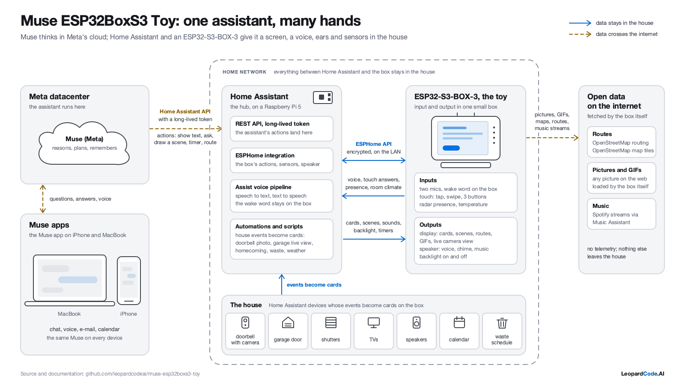</p>

Left to right: the assistant reasons in its own cloud (Muse in Meta's datacenter, or Claude, or whatever you run), talks to Home Assistant through its API with a long-lived token, and Home Assistant talks to the box over ESPHome's encrypted native API on the LAN. The box is an input device (microphones, touch, radar, climate) and an output device (display, speaker, backlight) at the same time. Devices in the house trigger automations that become cards: the doorbell with its photo, the garage door with a live view, someone coming home, waste collection tomorrow ([homeassistant/](homeassistant/)). The box fetches pictures, tiles and routes itself, from the hosts you name. The diagram is an SVG ([docs/diagram/](docs/diagram/)), re-rendered by one command.

## Who talks to it

Everything the box can do is a Home Assistant action named `esphome.<device>_muse_<something>`, with the device `muse-esp32-s3-box-3-screen` that is `esphome.muse_esp32_s3_box_3_screen_muse_show_text` and so on. Whoever can call Home Assistant can drive the box; the prompt that teaches an assistant the box is in [docs/ASSISTANT_PROMPT.md](docs/ASSISTANT_PROMPT.md), in English and in German, and it is the whole integration: paste it once, the assistant remembers.

| Assistant | How it reaches the box | What it needs |
|---|---|---|
| Meta Muse | its Home Assistant connection, with a long-lived access token [10] | the prompt, pasted once into a chat with Muse |
| Claude (Code, Desktop, app) | the Home Assistant MCP server, or [`tools/muse_screen.py`](tools/muse_screen.py) from a shell | the same prompt as a project instruction, or `CLAUDE.md` of your own |
| Grok, Dots, Spark, any agent | Home Assistant's REST API: `POST /api/services/esphome/muse_esp32_s3_box_3_screen_<action>` with `Authorization: Bearer <token>` [10] | the prompt and a token; `tools/muse_screen.py` shows every call |
| Home Assistant itself | automations and scripts, and its voice assistant for timers and conversation | the examples in [homeassistant/](homeassistant/) |

"Muse" in the name is where this started: the box was built to give Meta's Muse a body in a house in Germany, where Meta's own gadget pairing is not available (see [What Meta's own SDK does differently](#what-metas-own-sdk-does-differently)). Nothing in the firmware is tied to Muse; the figure, the status words and the prompt are the only things that mention it, and all three are yours to change. Four scenes, one per assistant that is not Muse, rendered from `scenes/hello_*.txt`:

| | | | |
|---|---|---|---|
| 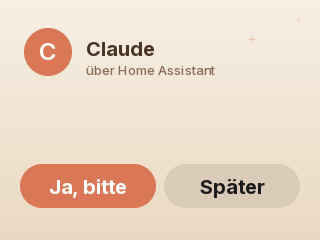 | 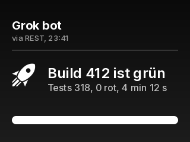 | 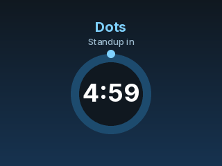 |  |
| Claude asks before acting | a Grok bot reports a build | Dots counts down | Spark celebrates |

Each of these is five to fourteen lines of scene text. The assistant that sends it decides the look; the box only draws.

## Hardware

The exact board matters: this is the **ESP32-S3-BOX-3** (2023), not the BOX or the BOX-Lite, whose pins, codecs and touch controllers differ. Espressif sells it as the full kit with four accessories (BOX-3-DOCK, BOX-3-SENSOR, BOX-3-BRACKET, BOX-3-BREAD) and as the BOX-3B with fewer of them [1] [3].

| Part | Needed | What the firmware does with it | Where to get it |
|---|---|---|---|
| ESP32-S3-BOX-3 (ESP32-S3-WROOM-1, 16 MB flash, 16 MB octal PSRAM, 2.4 inch 320 x 240 touch display, two microphones, speaker, three buttons) [1] | yes | everything on screen, the wake word, voice, touch, the chime | DigiKey listed the BOX-3B at 43.75 USD on 7 October 2026, out of stock that day [4]; Mouser, Espressif's AliExpress store [3] and the usual distributors carry both kits |
| BOX-3-SENSOR dock (AHT20 temperature and humidity, 24 GHz radar, IR sender and receiver, 18650 battery holder with charger, microSD slot) [1] | no, but most of the fun | presence, room climate, the battery gauge, the optional TV remote | part of the full kit |
| an 18650 cell | no | the battery gauge; the box runs from USB-C without it | any electronics shop |
| a USB-C data cable | for the first flash | after that, every flash is over the air | |
| Home Assistant 2026.9 or newer with ESPHome 2026.9.1 or newer | yes | the other half of the screen | [home-assistant.io](https://www.home-assistant.io), [esphome.io](https://esphome.io) |

Pins, bus addresses and what a healthy box answers to `muse_hw_check` are in [docs/HARDWARE.md](docs/HARDWARE.md); the pin facts come from Espressif's board support package [2]. Unboxing, download mode, the first flash and the way into Home Assistant, step by step: [docs/BOX3_SETUP.md](docs/BOX3_SETUP.md).

## Quick start

Seven steps from a box in its packaging to the first card. Expect 15 minutes plus one compile of 5 to 8 minutes on an Apple Silicon Mac (first build; later builds take 1 to 2 minutes).

1. **Clone and configure.**

   ```bash
   git clone https://github.com/leopardcodeai/muse-esp32-s3-box-3-screen.git
   cd muse-esp32-s3-box-3-screen/firmware
   cp secrets.yaml.example secrets.yaml
   ```

   Fill in `secrets.yaml`: Wi-Fi name and password, a password for the fallback hotspot, and an API key. ESPHome's API key is 32 random bytes in base64; `openssl rand -base64 32` makes one. `secrets.yaml` is in `.gitignore` and stays on your machine.

2. **Look at the substitutions** at the top of [`firmware/muse-esp32-s3-box-3-screen.yaml`](firmware/muse-esp32-s3-box-3-screen.yaml): the device name, your Home Assistant URL, the tile server, the temperature offset, the figure. The defaults work; change them later.

3. **Compile and flash over USB.** Put the box into download mode (hold BOOT, press RESET, release BOOT; the LCD stays dark) and run

   ```bash
   esphome run muse-esp32-s3-box-3-screen.yaml
   ```

   ESPHome picks the serial port, flashes, and opens the log. From then on `esphome run muse-esp32-s3-box-3-screen.yaml --device muse-esp32-s3-box-3-screen.local` flashes over the air.

4. **Read the log** until the box has joined Wi-Fi and the audio chips report (`audio_init: ... set up`). No `[W]` or `[E]` lines are the goal; the box prints `scene:` and `card` lines later as it works.

5. **Add it to Home Assistant.** Settings, Devices and services: the ESPHome device appears as discovered; add it with the API key from `secrets.yaml`. The box calls no Home Assistant action of its own, so "Allow the device to perform Home Assistant actions" can stay off; it only reads two states, `zone.home` for routes and `sun.sun` for the backlight.

6. **Give it a voice.** On the device page, pick an Assist pipeline for the voice assistant. Say "Hey Jarvis" (the model behind the name "Muse"), or long-press the ready screen.

7. **Send the first card.** Developer tools, Actions, `esphome.muse_esp32_s3_box_3_screen_muse_show_text` with a title and a message. Or from a shell:

   ```bash
   HA_URL=http://homeassistant.local:8123 HA_TOKEN=... python3 tools/muse_screen.py text "Hallo" "Die Box ist da."
   ```

   Then paste [docs/ASSISTANT_PROMPT.md](docs/ASSISTANT_PROMPT.md) into your assistant and ask it for a scene.

## Flash it with Claude Code

Meta's gadget SDK describes its fastest route as its own coding agent reading `AGENTS.md` and flashing the board [7]. This repository does the same with any coding agent: [`CLAUDE.md`](CLAUDE.md) and [`AGENTS.md`](AGENTS.md) hold the rules, the pinout and the flash flow; [docs/FLASHING_WITH_CLAUDE_CODE.md](docs/FLASHING_WITH_CLAUDE_CODE.md) is the step-by-step version with what the agent checks that people forget (the font warning in the compile output, the audio chips at boot, the glyph warnings in the log, the memory lines).

Open the folder in Claude Code and say:

> Flash the box over USB, then read its log for two minutes and tell me whether the audio chips came up and whether anything warns.

The agent runs `esphome run`, watches the log, and reports. It never needs your secrets: `secrets.yaml` is read by ESPHome, not by the agent, and the token for Home Assistant stays in your keychain or environment, never in a file of this repository.

## Make it yours

**Substitutions** (the top of `firmware/muse-esp32-s3-box-3-screen.yaml`):

| Substitution | Default | Effect |
|---|---|---|
| `name`, `friendly_name` | `muse-esp32-s3-box-3-screen`, `Muse ESP32-S3-BOX-3 Screen` | the device name, also the mDNS name and the prefix of every action and entity |
| `ha_url` | `http://homeassistant.local:8123` | where the box fetches your doorbell picture and camera views |
| `doorbell_image` | `/local/doorbell_latest.jpg` | the still picture under Home Assistant's `www` folder that `muse_show_image` shows when its `url` is empty |
| `map_tiles` | `https://tile.openstreetmap.org/{z}/{x}/{y}.png` | the tile server for route maps: any `{z}/{x}/{y}` server with 256 px PNG tiles, your own included |
| `temperature_offset` | `-8.34` | corrects the dock's AHT20, which sits beside the warm board; `0` shows the raw value |
| `figure_prefix` | `""` | `""` draws the project's own figure; `muse_` draws Meta's Muse animations after you ran `tools/make_muse_assets.py` on a machine with the Muse app |

**Secrets** stay in `firmware/secrets.yaml`, which git ignores: Wi-Fi, the hotspot password, the API key that also encrypts OTA uploads. There is no token anywhere in the repository and the tools take theirs from the environment (`HA_TOKEN`). `tools/check_private.py` scans the tree for private addresses, tokens, e-mail addresses and the house's names before every commit, and refuses a changed figure.

**Your own overlay.** The cleanest way to keep a house-specific setup is one small YAML that includes `muse-esp32-s3-box-3-screen.yaml` as a package and overrides what differs: your names for the entities (`!extend` by id, every entity has one), a fixed IP, Meta's figure, the optional TV remote. The firmware stays untouched and `git pull` brings new features. How, with a complete example: [docs/HOME_OVERLAY.md](docs/HOME_OVERLAY.md).

**The project's figure.** The box ships its own character: a glossy, soft 3D, round blue creature with big dark eyes, a tuft on top and tiny hands, the one on the hero picture. An image model (OpenAI's `gpt-image-2.5-flare`, 8 October 2026) drew it once from that picture and then in five poses (neutral, blink, wave, thinking, celebrating), each an edit of the first so the character stays the same; the PNGs and their prompts are in [`tools/figure_source/`](tools/figure_source/) (`tools/make_figure_source.py` asks again, on purpose only). `tools/make_figure.py` turns the poses into the box's animations: a bob and a blink for idle, a sway for wave, an orbiting spark for working, sparkles for making, confetti for the celebration, 16 or 18 frames each, dithered to RGB565.

**Meta's figure.** The animations of the Muse app are Meta's artwork and are not in this repository. If you have the Muse app installed, `tools/make_muse_assets.py` cuts the app's own videos into `firmware/figure/muse_*.png`, which `.gitignore` keeps out of git; set `figure_prefix: "muse_"` and rebuild. The app's typeface (Optimistic) is not used, because its licence forbids altering it.

**Language.** The screen speaks German by default (status words, "Zeit ist um", the weekday); [docs/LOCALIZATION.md](docs/LOCALIZATION.md) lists the strings. The actions take whatever language the assistant sends.

## Actions

Twenty-one actions, all under `esphome.<device>_`. Home Assistant makes every field mandatory; send `""` where nothing is meant. Each returns a response when asked for one (`return_response` in REST, `response_variable` in a script). Full reference with examples and responses: [docs/ACTIONS.md](docs/ACTIONS.md).

| Action | Fields | Shows |
|---|---|---|
| `muse_set_status` | `status` | the status pill: `ready`, `listening`, `thinking`, `speaking`, `working`, `making`, `quiet` |
| `muse_set_status_text` | `status`, `label` | the same with a text of your own |
| `muse_show_text` | `title`, `message` | a text card, 20 s; long texts page by themselves |
| `muse_show_value` | `label`, `value`, `unit` | one big number with its unit |
| `muse_show_weather` | `condition`, `temperature`, `message` | an animated weather icon, the temperature, a line |
| `muse_show_event` | `icon`, `title`, `message` | an event from the house: coloured disc, icon, text |
| `muse_show_image` | `title`, `message`, `url` | a JPEG, PNG or GIF from a URL, or the doorbell picture when `url` is empty |
| `muse_show_live` | `title`, `url`, `seconds` | a camera's pictures in a row for that long |
| `muse_show_route` | `title`, `from`, `to`, `mode` | a route on a map: place names, coordinates or `home`; `car`, `bike`, `foot` |
| `muse_show_agenda` | `title`, `events` | the day's appointments, one per line, four at a time |
| `muse_show_list` | `title`, `items` | a list with ticks |
| `muse_show_timer` | `label`, `duration` | a timer: `5`, `5 min`, `1:30`, `90 s` |
| `muse_cancel_timer` | `label` | ends a timer early |
| `muse_celebrate` | `title`, `message` | confetti, 30 s |
| `muse_draw` | `scene` | a scene in the drawing language |
| `muse_ask` | `question`, `yes_label`, `no_label` | a yes or no question with two buttons; waits 25 s for the answer |
| `muse_choose` | `question`, `options` | a question with two to four answers, one per line |
| `muse_wait_answer` | `seconds` | waits for the touch on a question or a scene button and returns it |
| `muse_clear` | | every card gone, the line emptied |
| `muse_get_state` | | what is on screen, what waits, timers, battery, Wi-Fi, volume, version |
| `muse_hw_check` | | every chip's id and state, the pins, the battery, the audio set-up; reads nothing but registers |

A drop-in automation, the doorbell with its photo; `continue_on_error` keeps the automation alive when the box is off:

```yaml
alias: Doorbell on the box
trigger:
  - platform: state
    entity_id: binary_sensor.doorbell_ring
    to: "on"
action:
  - action: esphome.muse_esp32_s3_box_3_screen_muse_show_event
    continue_on_error: true
    data:
      icon: doorbell
      title: Es klingelt
      message: Jemand steht vor der Tür.
  - delay: "00:00:05"
  - action: esphome.muse_esp32_s3_box_3_screen_muse_show_image
    continue_on_error: true
    data:
      title: Es klingelt
      message: ""
      url: ""
```

The second card replaces the first without a tap, because it carries the same title. Four such automations and a weather script are in [homeassistant/](homeassistant/).

## Scenes: the drawing language

`muse_draw` takes a picture described in lines of text. The box parses it once, draws it ten times a second, and answers with every line it did not understand, with a suggestion where there is one.

```text
bg #0b1d3a #3a1c5c
circle 252 58 26 #ffd166 pulse=3000
text 20 70 "Gute Nacht, Sam" size=xl color=white
text 20 118 "Morgen 7 Grad, ab 10 Uhr Sonne" color=#c9d6ff w=280
icon 40 190 weather-night color=#c9d6ff
particles sparkle 30
seconds 60
```

Commands: `bg`, `rect`, `circle`, `line`, `tri`, `star`, `poly`, `text`, `icon`, `muse`, `bar`, `particles`, `button`, `seconds`, `frame`, `once`. Every element takes `opacity`, `delay`, `dur`, `fade`, `blink`, `move`, and where it makes sense `spin`, `pulse`, `type`. Colours by hex or by name, text in six sizes from 13 to 54 px, 273 icons by their Material Design name or a German word, `{time}` and `{date}`. Limits: 16 KB of scene, 250 elements, 24 frames, 150 particles per command, 500 characters per text. A scene that needs more than 90 ms per picture is drawn less often and says so in the log. The grammar, every key and the error messages: [docs/SCENES.md](docs/SCENES.md).

Why a language of its own and not Lovelace, LVGL or an image: an assistant writes text well and fast, a 320 x 240 screen needs no layout engine, and a scene of 400 bytes travels through any API. The parser has a host test with sanitizers (`tools/tests/test_muse_scene.cpp`) and the renderer in `tools/render_scene.py` is its second implementation, which is how the previews above were made.

## Touch, buttons and the status bar

| Touch | On a card | On the ready screen |
|---|---|---|
| tap | the next card in line, or the status | the figure is cuddled: it waves and wiggles, hearts rise for 2.6 s |
| swipe left | the next card | |
| swipe right | the card before (the last six are kept) | the last card again |
| swipe down | every card gone | |
| long press, 0.7 s | every card gone | the voice assistant listens, unless the mute switch is on |
| tap on the top bar | the box about itself for 15 s: battery, Wi-Fi, room air, uptime, free memory, what waits | the same |
| on a question or a scene button | the button under the finger answers | |

The three physical controls: the **mute switch** on top cuts the microphones in hardware (the bar shows a crossed-out microphone), the **top left button** switches the display off and on, the **bottom left switch** is power.

The status bar, after an iPhone: the name on the left with the soonest timer ("4:59") and an orange "+N" for waiting cards, the time in the middle, and on the right the battery, the Wi-Fi fan, an orange dot while the box listens, a teal dot while the radar sees someone. The backlight follows the day from `sun.sun`: 100 % while the sun is up, 80 % in the evening, 65 % from 23:00 to 06:00, 10 % when the assistant is told to be quiet.

## Entities in Home Assistant

| Entity | Kind | Use |
|---|---|---|
| Temperature, Humidity | sensor | the dock's AHT20, corrected (see `temperature_offset`); humidity recalculated for the corrected temperature with the Magnus formula |
| Battery | sensor | the 18650 as a percentage; 4.21 V reads 100 % |
| Wi-Fi Signal | sensor | dBm |
| Answer | text sensor | every answer a touch gave, as `<answer>: <question>`; `none: ...` when a question left unanswered |
| Presence | binary sensor | the radar, held 30 s after the last movement |
| Mute Switch, Top Left Button | binary sensor | the hardware controls, for automations of your own |
| Backlight | light | the display's brightness; automations may set it, the schedule takes over again at the next step |
| Speaker | media player | the box's speaker for Home Assistant, Music Assistant, TTS |
| Night Calm Display | switch | off by default: dark between 23:00 and 06:00 once nobody was seen for 10 min and nothing is on screen |
| the Assist satellite | assist satellite | the voice assistant, its pipeline and wake word |

The optional Samsung TV remote package ([firmware/packages/samsung_tv_ir.yaml](firmware/packages/samsung_tv_ir.yaml), through the dock's IR, off by default) adds an action `tv_key`, 21 buttons and two sensors for received codes.

## Pictures, GIFs, live views, routes and music

Pictures are fetched and decoded by a task of their own on the second core, so the display never waits and the Bluetooth proxy keeps its events. The format comes from the first bytes, not from the Content-Type header, because file hosts answer `application/octet-stream`. JPEGs decode at 1/2, 1/4 or 1/8 size right away (JPEGDEC [13]), PNGs stream through pngle [14], GIFs play through AnimatedGIF [12] on a canvas of their own. The decoders and the pictures live in PSRAM on purpose: internal RAM has 64 to 82 KB free beside Wi-Fi, Bluetooth and TLS.

- **Photos and GIFs**: `muse_show_image` with any `http(s)` URL; 3 MB per file, 15 s timeout, five redirects. Home Assistant's camera snapshots work as `url` too, with their token in the query, which the box never logs.
- **Live view**: `muse_show_live` with a camera's `camera_proxy` URL and `&width=300&height=168` gives about one picture per second.
- **Routes**: `muse_show_route` asks OpenStreetMap's Nominatim for place names [22], routing.openstreetmap.de (OSRM by FOSSGIS e.V. [19] [23]) for the way, and stitches the map from up to six 256 px tiles of your `map_tiles` server over one kept TLS connection. The box draws the way, the two points and the attribution the tiles require [20] [21]. "home" is your `zone.home`.
- **Music**: the Speaker is a Home Assistant media player; Music Assistant [11] with its Home Assistant player provider streams Spotify, radio and your library to it (FLAC 48 kHz stereo was measured).

## Performance, measured

All on one box, firmware 4.0 to 4.1, 7 October 2026, from the box's own log lines.

| What | Measured |
|---|---|
| a card's real time on screen | text 20.08 s, value 20.02 s, events 20.01 to 20.03 s, confetti 30.07 s (set: 20, 20, 20, 30) |
| one picture of a scene | 29 ms for a gradient, a pulsing moon, text, an icon and 30 sparkles (31 pictures in the first 3 s); 101 ms for a scene overloaded on purpose with 270 particles, 40 heart icons, five translucent shapes and 54 px text |
| the doorbell picture, 1152 x 864 JPEG | 0.54 s (ESPHome's `online_image` in the main loop needed 5.6 s) |
| a camera's 2880 x 1616 JPEG | 2.8 s (27 to 32 s before, and the Bluetooth proxy dropped 978 events meanwhile) |
| a 330 px JPEG from the web | 3.8 s, most of it the TLS handshake |
| a GIF of 1 MB, 400 x 400, 44 frames | loaded in 6.3 s, played |
| a live view | 18 pictures in 15 s |
| a route on foot, 200 m, zoom 16 | 7.2 s from the request to the card: two place lookups, 3.6 s for the routing answer (629 bytes, TLS 1.3), 4 tiles in 1.72 s over one connection |
| a route by bike, 1.4 km, zoom 14 | 9.0 s: routing 3.5 s, 4 tiles in 2.11 s |
| the radar before the 30 s hold | 1,423 changes and 696 times "on" in 24 h; now one wave per arrival |
| the audio chips at boot | both fail to set up although they answer on the bus; the retry 3 s later succeeds at the first try on every boot since |
| RAM free at rest | 64 to 82 KB internal, 16 MB PSRAM |
| build | Flash 95 %, RAM 49 % (static), compile 5 to 8 min cold on an M-series Mac |

Two findings behind those numbers that cost real time: with mbedTLS in internal RAM the display's DMA transfer failed during handshakes (`spi: Transmit failed - err 101`), so TLS buffers go to PSRAM (`CONFIG_MBEDTLS_EXTERNAL_MEM_ALLOC`); and routing.openstreetmap.de speaks TLS 1.3 only, which ESPHome's default of dropping the peer certificate after the handshake breaks (`disable_mbedtls_peer_cert: false`, `CONFIG_MBEDTLS_SSL_PROTO_TLS1_3`).

## Privacy and security

- **What leaves the house**: the URLs you send for pictures, the start and destination of a route and the tiles around it, your voice to the pipeline you configured, what you play on Spotify, and the downloads of a build. Nothing is sent to LeopardCode.AI; there is no telemetry. Hosts and policies: [docs/PRIVACY.md](docs/PRIVACY.md).
- **On the LAN**: the ESPHome API and OTA uploads are encrypted with the key in `secrets.yaml`. Home Assistant asks for that key once.
- **Tokens**: the box holds none. The assistant's token for Home Assistant lives wherever that assistant keeps it; the tools here read `HA_TOKEN` from the environment and never write it. If a token leaks, revoke it in Home Assistant's profile page and make a new one [10].
- **Meta's artwork and names**: not in the repository, by checksum and by `tools/check_private.py`.
- **Map tiles**: OpenStreetMap's server allows apps that identify themselves and stay light [20]; the box sends a user agent that names this repository and shows the attribution on every map [21]. Until 4.0 the map came as one picture from Wikimedia's map service, whose terms allow that for Wikimedia projects only; 4.1 switched to tiles from a server you choose.

## Troubleshooting

| Symptom | Cause | Fix |
|---|---|---|
| `esphome run` cannot find the port, or the flash fails at 2 % | the box is not in download mode | hold BOOT, press RESET, release BOOT, try again; a charge-only cable shows no port at all |
| the box boots, the log says `audio_init: codecs not ready, try 2` | the ES8311 and ES7210 do not come up on the first try after power-on | normal; the script retries every 3 s and reports when both answer. More than three tries means the dock is not seated |
| the compile warns `Inter missing 1 glyph U+030B` | Google's Latin Core set asks for a combining accent Inter lacks | harmless, `ignore_missing_glyphs: true` is set for that |
| `Codepoint U+... not found in font` in the box's log, ten times a second | a card or scene uses a character the font does not have (an emoji, a rare accent) | the firmware drops emojis itself; for other characters add them to the `glyphs` list of the font or use `size=xl` or smaller |
| a picture card turns into "Bild: HTTP 404" or "Bild: connection failed (...; DNS, TLS or no route)" | the URL is wrong, the host needs TLS 1.3 or the box has no DNS | check the URL in a browser first; with a fixed IP set `dns1` under `manual_ip`; TLS 1.3 is on |
| a route says "map failed: tile is not a PNG" | the tile server sends JPEG or WebP | use a server with PNG tiles, or raster tiles of your own |
| "Route: place not found: ..." | Nominatim did not know the name | send coordinates (`50.94,6.96`), or a more complete name with the town |
| the figure is a round blue character, not Muse | that is the project's own figure, on purpose | see Meta's figure under [Make it yours](#make-it-yours) |
| Home Assistant shows "Re-authentication required" after a flash | you added or changed the API key | enter the key from `secrets.yaml` once |
| Spotify through Music Assistant waits 30 s and plays nothing | Music Assistant throttles its Spotify Web API calls on a shared allowance | wait a minute; radio and local files play at once |
| the first flash over USB succeeds, the box never joins Wi-Fi | the SSID or password in `secrets.yaml` is wrong, or the network is 5 GHz only | the ESP32-S3 has 2.4 GHz only; the fallback hotspot `muse-esp32-s3-box-3-screen` appears after 90 s |

## FAQ

**Does it need Muse?** No. It needs Home Assistant. Muse, Claude, a Grok bot, a cron job: the box does not know who sends the action.

**Does it need the internet?** Only for pictures from the web, routes and music streams. The wake word runs on the box; the voice pipeline is whatever you run in Home Assistant, local included.

**Why ESPHome and not Meta's gadget SDK on this board?** The SDK pairs the box to the Muse app as a gadget and leaves the dock, the battery, the IR and the wake word out [8]; the Muse app itself rolled out in the US first [9]. ESPHome gives the box to Home Assistant, which exists in every country and already knows the house. The two are not exclusive; this one has no Meta account in the loop.

**Can it show my own figure?** Yes: six animated PNGs of 160 x 160 and a 72 x 72 avatar, the names in `firmware/figure/`. `tools/make_figure.py` is the template: it animates five still poses of a character (any PNGs with a transparent background in `tools/figure_source/`) and dithers the frames to RGB565 so gradients do not band.

**Why German on the screen?** Because the house is. [docs/LOCALIZATION.md](docs/LOCALIZATION.md) lists every string; the actions carry whatever language the assistant writes.

**Does it run on the ESP32-S3-BOX or BOX-Lite?** Not as is. The BOX-3's codecs, touch controller and dock pins are in the YAML; a port needs the other board's BSP and a day of testing. Pull requests welcome.

**Why is Flash at 95 %?** Five animations of 16 to 18 frames at 160 x 160 and the avatar, in RGB565, are 4.2 MB, the icon font in two sizes and the 273 icons another chunk, the TLS bundle, Bluetooth proxy, voice assistant and the three decoders the rest. The 16 MB flash holds two 8 MB OTA slots; trimming animations frees space fastest.

## Repository layout

```text
muse-esp32-s3-box-3-screen/
  firmware/
    muse-esp32-s3-box-3-screen.yaml            the ESPHome configuration: actions, display, touch, audio, sensors
    muse.h                   drawing helpers, card queue, questions, timers, lists, the status bar
    muse_scene.h             the parser of the drawing language
    muse_media.h             the picture task: downloads, JPEG, PNG, GIF, live views, routes, tiles
    muse_fit.h               text fitting and wrapping
    muse_icons.h             273 icons, generated from muse_icon_glyphs.yaml
    muse_gif/                AnimatedGIF 2.2.3, Apache 2.0, with an ESP-IDF shim
    figure/                  the project's figure, built by tools/make_figure.py (Meta's frames go here as muse_*.png, ignored)
    icons/                   Meteocons weather icons as PNG, MIT
    sounds/                  the chime and the question sound, generated
    wakewords/               the hey_jarvis model shown as "Muse"
    packages/samsung_tv_ir.yaml   optional: a Samsung TV remote through the dock's IR
    secrets.yaml.example     copy to secrets.yaml and fill in
  homeassistant/             four example automations and a weather script
  web/                       the display as a web app for a Mac: the same cards and scenes on a canvas, fed through
                             Home Assistant's websocket, installable as a Dock app, demo mode, Node tests (web/README.md)
  scenes/                    scenes to send as they are, and the sources of the previews
  docs/                      actions, scenes, hardware, setup, flashing with an agent, privacy, the overlay, the diagram, previews
  tools/
    muse_screen.py              a command line for every action over the REST API
    render_scene.py          renders a scene to PNG or GIF exactly as the box would
    check_private.py         refuses private data before a commit
    make_figure.py           the figure's animations from the poses in figure_source/ (make_figure_source.py made those)
    make_icon_table.py, make_sounds.py, make_weather_icons.py, make_muse_assets.py, make_hero_image.py
    tests/                   host tests of the parser and the text fitting (ASan, UBSan)
  CLAUDE.md, AGENTS.md       the rules and the flash flow for coding agents
  CHANGELOG.md, LICENSE, NOTICE
```

## Development

- **Versions**: the newest stable ESPHome and the ESP-IDF it ships (`esp32: framework: type: esp-idf`), checked before every build, never changed in the middle of one. `min_version: 2026.9.0` is enforced in the YAML.
- **Web app tests**: `node --test web/test` (85 tests, no dependencies); the demo is `cd web && python3 -m http.server 8321`, then `http://localhost:8321/index.html?demo=1`.
- **Host tests**: `tools/tests/` compile with `clang++ -fsanitize=address,undefined` and run in a second; `tools/test_render_scene.py` runs with `uv run --python 3.14 --with pillow --with fonttools --with pytest -m pytest tools/ -q` (13 tests).
- **Previews**: `uv run --python 3.14 --with pillow --with fonttools tools/render_scene.py --all scenes docs/previews --clock "2026-10-07 21:30"` rebuilds every PNG and GIF in 6 s; a fixed clock keeps the files byte-identical between runs.
- **Before a commit**: `python3 tools/check_private.py`, then `esphome config firmware/muse-esp32-s3-box-3-screen.yaml`.
- **The hero picture**: `tools/make_hero_image.py --provider openai` asks an image model for a new one and writes the prompt beside it; the chosen file is committed with its `.txt`, and it is not regenerated on a whim, because every run differs.
- **The figure**: `uv run --python 3.14 --with pillow --with numpy tools/make_figure.py` rebuilds the six files in `firmware/figure/` from the committed poses; then `python3 tools/check_private.py --record-figure`, copy the six files to `web/figure-default/`, rebuild the previews and the app icons (`web/tools/make_app_icons.py`). The poses themselves come from `tools/make_figure_source.py` (OpenAI, key from the environment) and are kept, not regenerated.
- **Icons**: `tools/make_icon_table.py` regenerates `muse_icons.h` from `muse_icon_glyphs.yaml` and the Material Design Icons font; a codepoint is never guessed, it is looked up.
- **Adding an action**: copy the shortest one in `muse-esp32-s3-box-3-screen.yaml` (`muse_show_value`), give it a mode in the display lambda, a line in `docs/ACTIONS.md` and in the prompt, and a scene or card in `scenes/` when it draws something new. Home Assistant makes every field mandatory, so document the empty value.

## What Meta's own SDK does differently

Meta publishes the Muse Gadget SDK, Apache 2.0, for ESP32 boards and Linux machines; a gadget pairs with the Muse app through an SDK token and the app's developer mode [7]. Its page for this very board states what is not integrated: "Dock sensors, SD card, IR, battery telemetry, and wake-word detection are not integrated", the capacitive home button neither [8]. This screen takes the opposite route and keeps the house's hub in the middle:

| | Muse Gadget SDK on the BOX-3 [7] [8] | this screen |
|---|---|---|
| who the box talks to | the Muse app, paired as a gadget | Home Assistant, as an ESPHome device; any assistant through Home Assistant |
| account needed | a Muse account with an SDK token, Muse available in your country [9] | a Home Assistant instance |
| wake word | not integrated | on the box, microWakeWord |
| dock sensors, battery, IR | not integrated | radar, climate, battery gauge, optional IR remote |
| what the screen shows | the SDK's own UI | cards and scenes the assistant designs |
| secrets in the firmware | the SDK token, treated as an identifier | the Wi-Fi and an API key, both in an ignored file |
| the fastest way in | Meta's coding agent reading `AGENTS.md` | any coding agent reading `CLAUDE.md` or `AGENTS.md` |

## Comparable projects

Five projects were read before this README was written, so that nothing they do well is missing here: a voice assistant with characters and a draw-on-screen action in pure ESPHome [24a], an LVGL dashboard with a page per screen [24b], a modular voice assistant [24c], the custom firmware most of them credit, with a browser installer [24d], and Meta's SDK [7]. What this screen adds: a drawing language the assistant writes itself, a card queue with touch answers that flow back to the agent, timers, routes, GIFs, a sensor dock in use, previews rendered from the code, and a privacy page that names every host.

## Licence and third-party work

Apache License 2.0 ([LICENSE](LICENSE)). Third-party work, each under its own licence, listed in [NOTICE](NOTICE):

| Work | Licence | Where |
|---|---|---|
| ESPHome, ESP-IDF | Apache 2.0 | fetched at build time |
| AnimatedGIF 2.2.3, Larry Bank [12] | Apache 2.0 | `firmware/muse_gif/`, with two small replacements for Arduino's `millis()` and `delay()` |
| JPEGDEC, Larry Bank [13]; pngle, kikuchan [14] | Apache 2.0; MIT | fetched by ESPHome |
| Material Design Icons 7.4.47, Pictogrammers [15] | Apache 2.0 | fetched at build time |
| Meteocons 2.0.0, Bas Milius [16] | MIT | `firmware/icons/` |
| Inter, Rasmus Andersson [17] | SIL OFL 1.1 | fetched from Google Fonts at build time |
| microWakeWord `hey_jarvis`, Kevin Ahrendt [18] | Apache 2.0 | `firmware/wakewords/` |
| map tiles and routes | ODbL, OpenStreetMap contributors [25]; the services' usage policies [19] [20] [22] | at run time |

"Muse" is Meta's assistant and trademark. This project is not affiliated with, endorsed by or supported by Meta. The character animations of the Muse app are Meta's artwork; they are not part of this repository and must not be redistributed.

Made by [LeopardCode.AI](https://leopardcode.ai), Dr.-Ing. Alexander Brunker, as a Labs project. Issues and pull requests are welcome; a bug report helps most with the ESPHome version, the way you flashed, and the box's log around the moment it went wrong.

## Sources

Every statement about hardware, services and other projects above refers to one of these; accessed on 7 October 2026 unless noted.

1. Espressif Systems, *ESP32-S3-BOX-3 Hardware Overview*, in the esp-box repository: https://github.com/espressif/esp-box/blob/master/docs/hardware_overview/esp32_s3_box_3/hardware_overview_for_box_3.md (module, 16 MB flash and 16 MB octal PSRAM, 2.4 inch 320 x 240 touch screen, two microphones, speaker, three buttons, the four accessories).
2. Espressif Systems, *esp-bsp*, board support package `bsp/esp-box-3/include/bsp/esp-box-3.h`: https://github.com/espressif/esp-bsp/blob/master/bsp/esp-box-3/include/bsp/esp-box-3.h (pins and bus addresses).
3. Espressif Systems, *esp-box* README: https://github.com/espressif/esp-box ("the ESP32-S3-BOX-3 represents the standard edition with four blue accessories, the ESP32-S3-BOX-3B provides fewer accessories"; Apache 2.0; the AliExpress store link).
4. DigiKey, product page ESP32-S3-BOX-3B, Espressif Systems, part 22286690: https://www.digikey.com/en/products/detail/espressif-systems/ESP32-S3-BOX-3B/22286690 (43.75 USD, 0 in stock, read on 7 October 2026).
5. ESPHome documentation: *Native API Component*, user-defined actions: https://esphome.io/components/api ; *micro_wake_word*: https://esphome.io/components/micro_wake_word ; *Voice Assistant*: https://esphome.io/components/voice_assistant ; *Speaker Media Player*: https://esphome.io/components/media_player/speaker ; *GT911 Touch Screen Controller*: https://esphome.io/components/touchscreen/gt911 ; *ILI9xxx TFT LCD Series*: https://esphome.io/components/display/ili9xxx ; *Packages* (`!extend`, `!remove`): https://esphome.io/components/packages .
6. Espressif Systems, ESP-IDF v5.5 *ESP HTTP Client*: https://docs.espressif.com/projects/esp-idf/en/v5.5/esp32s3/api-reference/protocols/esp_http_client.html (connection reuse through `esp_http_client_set_url`).
7. Meta Platforms, *Muse Gadgets* (muse-gadget-sdk) README: https://github.com/facebookincubator/muse-gadget-sdk ("Muse Gadgets is licensed under the Apache License, Version 2.0"; "Before you flash or pair a gadget, get an SDK token"; Developer mode) and the ESP32 README: https://github.com/facebookincubator/muse-gadget-sdk/tree/main/esp32 (the coding agent reading `AGENTS.md`).
8. Meta Platforms, muse-gadget-sdk, *ESP32-S3-BOX-3* device page: https://github.com/facebookincubator/muse-gadget-sdk/blob/main/esp32/devices/esp32-s3-box-3.md ("Dock sensors, SD card, IR, battery telemetry, and wake-word detection are not integrated"; "The capacitive home button is not integrated"; "The token stays in the ignored build-muse-espressif-box-3/sdkconfig and the compiled firmware").
9. Meta Platforms, *Introducing Muse: The World's First Personal AI Agent Built for Everyone*, 9 September 2026: https://about.fb.com/news/2026/09/introducing-muse-personal-ai-agent/ ("Muse is rolling out in the US on iOS, Android, and muse.ai").
10. Home Assistant, *Authentication API*, long-lived access tokens: https://developers.home-assistant.io/docs/auth_api/#long-lived-access-token ; the REST API: https://developers.home-assistant.io/docs/api/rest/ .
11. Music Assistant, *Home Assistant* player support: https://www.music-assistant.io/player-support/home-assistant/ and the project site https://www.music-assistant.io/ (a project of the Open Home Foundation; Spotify among the providers).
12. Larry Bank, *AnimatedGIF*: https://github.com/bitbank2/AnimatedGIF (Apache 2.0, "an optimized GIF decoder suitable for microcontrollers and PCs").
13. Larry Bank, *JPEGDEC*: https://github.com/bitbank2/JPEGDEC (Apache 2.0, "fast downscaling options (1/2, 1/4, 1/8)").
14. kikuchan, *pngle*: https://github.com/kikuchan/pngle (MIT, "a stream based portable PNG Loader for Embedding").
15. Pictogrammers, *Material Design Icons* licence: https://pictogrammers.com/docs/general/license/ ("Icons: Apache 2.0").
16. Bas Milius, *Meteocons*: https://github.com/basmilius/weather-icons (MIT).
17. Rasmus Andersson, *Inter*: https://github.com/rsms/inter (SIL Open Font License 1.1).
18. Kevin Ahrendt, *microWakeWord*: https://github.com/kahrendt/microWakeWord and the model repository https://github.com/esphome/micro-wake-word-models (the `hey_jarvis` model).
19. FOSSGIS e.V., *routing.openstreetmap.de*, about and usage policy: https://routing.openstreetmap.de/about.html ("owned and operated by FOSSGIS"; OSRM; car, bike and foot worldwide; "Use a valid user agent"; "One request per second max"; attribution).
20. OpenStreetMap Foundation, *Tile Usage Policy*: https://operations.osmfoundation.org/policies/tiles/ (a distinct user agent, no bulk downloading, attribution; apps are permitted with "a distinct, stable User-Agent").
21. OpenStreetMap Foundation, *Licence/Attribution Guidelines*: https://osmfoundation.org/wiki/Licence/Attribution_Guidelines ("The historical forms of attribution '© OpenStreetMap contributors' or '© OpenStreetMap' are acceptable").
22. OpenStreetMap Foundation, *Nominatim Usage Policy*: https://operations.osmfoundation.org/policies/nominatim/ ("maximum of 1 request per second"; "Provide a valid HTTP Referer or User-Agent identifying the application").
23. Project OSRM, *Open Source Routing Machine*: http://project-osrm.org/ .
24. Comparable projects, read on 7 October 2026: (a) MichalZaniewicz, *esphome-esp32-s3-box-3-va*: https://github.com/MichalZaniewicz/esphome-esp32-s3-box-3-va and its fork f3mshep: https://github.com/f3mshep/esphome-esp32-s3-box-3-va ; (b) chrisdunnname, *esphome-s3-box-3-lvgl*: https://github.com/chrisdunnname/esphome-s3-box-3-lvgl ; (c) aschieweck, *ESP32-S3-Box-3-Voice-Assistant*: https://github.com/aschieweck/ESP32-S3-Box-3-Voice-Assistant ; (d) BigBobbas, *ESP32-S3-Box3-Custom-ESPHome*: https://github.com/BigBobbas/ESP32-S3-Box3-Custom-ESPHome .
25. OpenStreetMap, *Copyright and License*: https://www.openstreetmap.org/copyright (Open Database License).
26. Wikimedia Foundation, *Maps Terms of Use*: https://foundation.wikimedia.org/wiki/Policy:Maps_Terms_of_Use ("Wikimedia Maps may not be used by third-party services outside of the Wikimedia projects"), the reason for the change in 4.1.
