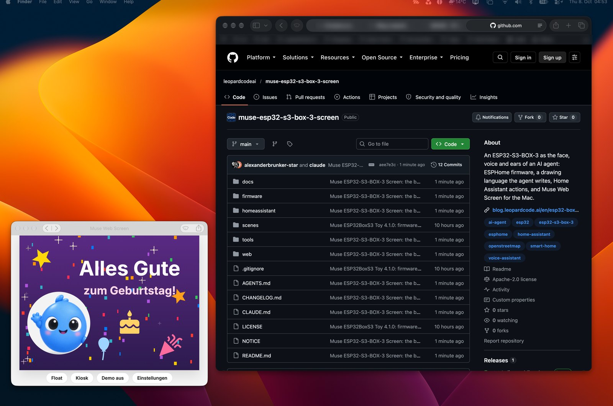

# Muse Web Screen as an app on your Mac

The box's twin as a borderless window that stays on top: the same cards and scenes as the
ESP32-S3-BOX-3, fed by the same Home Assistant actions, with your own figure and icon if you
like. About ten minutes, one click in Chrome and one paste of a token by you.

<p align="center"></p>

## Why Chrome and not Safari

Both can install the page as an app. For a screen that should stay in front, Chrome does more:

| | Safari web app (File, Add to Dock) | Chrome app (Install page as app) |
|---|---|---|
| always on top | only as a video picture-in-picture of the display, which **cannot be clicked** | Document Picture-in-Picture: a real window above all others that **stays clickable** (answer a question, swipe) [1] |
| title bar | always there | can be hidden: Window Controls Overlay, only the three window buttons stay [2] |
| page from https (the hosted demo) to Home Assistant on `ws://` | refused as mixed content [3] | asks for local network access, or refuses |

So the app below runs from a small local server on `http://localhost`, which may open `ws://`
to Home Assistant on your LAN like any local program, and it is installed from Chrome.

## 1. The local service

```bash
web/tools/serve_local.sh --install
```

It serves the `web/` folder at http://localhost:8321 from a LaunchAgent, bound to 127.0.0.1
only, and starts at every login. `--status` tells whether it runs, `--uninstall` removes it,
`--dry-run` shows the file it would write.

## 2. Install the app

Open http://localhost:8321/ in Chrome and click the install symbol at the right of the address
bar, or menu ⋮, *Cast, save and share*, *Install page as app*. Name it as you like; the app gets
its own window, Dock icon and an entry in `~/Applications/Chrome Apps.localized/`. The settings
belong to the origin `http://localhost:8321` in your Chrome profile, the tab and the app share
them.

## 3. Settings

Press **E** in the app (or the *Einstellungen* button):

| Field | Value |
|---|---|
| Home Assistant URL | the LAN address, for example `http://homeassistant.local:8123` |
| Long-lived access token | create one for this screen only: Home Assistant, your profile, *Security*, *Long-lived access tokens*. Paste it yourself; it stays in this browser's storage on this Mac |
| Device name | `muse_esp32_s3_box_3_screen`, or the name your box has (the part before `_muse_` in its actions) |
| Figure source | the project's figure, or your own frames (step 5) |
| Nur Display | on: no toolbar and no frame |

Without a box, automations can address the screen directly with the event `muse_web`
(web/README.md). Every action Home Assistant sends to the box also appears here, because the app
listens to Home Assistant's `call_service` events.

## 4. Borderless and on top

* **Nur Display** hides the toolbar; it comes back while the pointer is at the bottom edge. The
  strip beside the display takes the colour of the display's edge, so nothing sets it off.
* Click the **^** in the app's title bar: Chrome hands the title bar to the page (Window Controls
  Overlay), only the three window buttons remain. Click it again to get the bar back.
* **F** floats the display above every window and on every desktop (Document Picture-in-Picture,
  Chrome 116 and newer [1]); the window stays clickable. **F** again, or closing the small window,
  brings it back. **K** is full screen with the cursor hidden and the screen kept awake.

## 5. Your own figure (optional)

The app shows the project's own figure (`web/figure-default/`). To show your own animations, put six animated PNGs
into `web/local/`: `muse_idle.png`, `muse_wave.png`, `muse_working.png`, `muse_making.png`,
`muse_confetti.png` (160 x 160) and `muse_avatar.png` (72 x 72), the same set the firmware uses
(`tools/make_muse_assets.py` cuts them from the Muse app if you have it). Then set the figure
source to *Eigene Bilder aus einem Ordner* with `http://localhost:8321/local`. git and Vercel
ignore `web/local/`: an assistant's figure is usually someone else's artwork and stays on your
Mac. `?figure=placeholder` in the address shows the project's figure for one visit, for screenshots you
want to publish.

## 6. Your own icon (optional)


```bash
uv run --python 3.14 --with pillow --with numpy --with pyobjc-framework-Cocoa web/tools/set_mac_app_icon.py
```

It cuts a figure out of its plain background, sets it on a black macOS icon shape and puts it on
the installed app (`~/Applications/Chrome Apps.localized/Muse Web Screen.app`; `--app` for another
name). The default is the project's figure (`web/icons/icon-512.png`); `--image my_figure.png` takes yours, and `--fade 0.5`
lets a figure that the picture cuts off at the bottom run softly into the black. The PNG goes to
`web/local/`, never into git. Quit the app and open it again to see the new icon in the Dock;
after a Chrome update that resets the icon, run the command once more.

## When something is off

| Symptom | Cause | Fix |
|---|---|---|
| red dot top right, no cards | no token, wrong URL, or Home Assistant not reachable | E, check URL and token; `web/tools/serve_local.sh --status` |
| the demo plays instead of your cards | no settings stored for this origin yet | E, enter URL and token, save |
| cards come, but not from your box's actions | wrong device name | the part before `_muse_` in the box's actions, with underscores |
| figure status "5 of 6" | one frame missing or not reachable | check the six names in `web/local/`; the app retries once |
| the title bar does not go away | the app was installed before the manifest asked for it | uninstall and install again from http://localhost:8321/ |
| http://localhost:8321 does not answer | the service is not running, or the folder moved | `web/tools/serve_local.sh --install` again |

[1] MDN, *Document Picture-in-Picture API*, https://developer.mozilla.org/en-US/docs/Web/API/Document_Picture-in-Picture_API
[2] MDN, *Window Controls Overlay API*, https://developer.mozilla.org/en-US/docs/Web/API/Window_Controls_Overlay_API
[3] MDN, *Mixed content*, https://developer.mozilla.org/en-US/docs/Web/Security/Mixed_content
