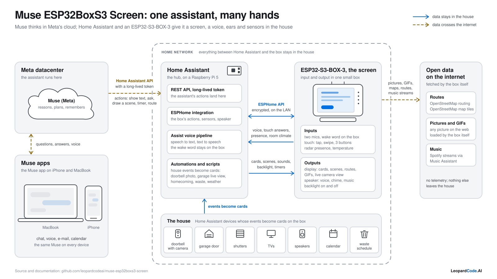

# System diagram

`system.svg` is the one picture of the whole project: who talks to whom, what flows, and
what stays in the house. `system.png` is the same picture rendered at 1600 px for places
that cannot show an SVG.



## What it shows, left to right

| Region | What it stands for |
|---|---|
| Meta datacenter | Muse, the assistant: it reasons, plans and remembers in Meta's cloud. |
| Muse apps | the Muse app on an iPhone and a MacBook: chat, voice, e-mail, calendar. The app talks only to the cloud. |
| Home Assistant | the hub, on a Raspberry Pi 5. Muse reaches it through the REST API with a long-lived token and calls the `esphome.muse_box_muse_*` actions (`docs/ACTIONS.md`). Inside: the ESPHome integration, the Assist voice pipeline (speech to text, text to speech) and the automations that turn house events into cards (`homeassistant/`). |
| ESP32-S3-BOX-3 | the toy, input and output in one box. Inputs: two microphones with the wake word on the box, touch, radar presence, temperature. Outputs: the display (cards, scenes, routes, GIFs, live camera view), the speaker (voice, chime, music), the backlight. |
| The house | the Home Assistant devices whose events become cards: doorbell with camera, garage door, shutters, TVs, speakers, calendar, waste schedule. |
| Open data on the internet | what the box fetches itself: OpenStreetMap routing and map tiles for routes, any picture or GIF on the web, Spotify streams through Music Assistant. Nothing else leaves the house (`docs/PRIVACY.md`). |

Two kinds of arrows, told apart by colour and line: solid blue for data that stays in
the house (the encrypted ESPHome API on the LAN, the events from the house), dashed amber
for data that crosses the internet (the Muse app and the cloud, the cloud and Home
Assistant's API, the box and the open data). The dashed grey frame is the home network.

## Re-render the PNG

The SVG is the source; the PNG is derived from it with cairosvg and is 1600 px wide:

```bash
cd docs/diagram
uv run --python 3.14 --with cairosvg python3 -c "import cairosvg; cairosvg.svg2png(url='system.svg', write_to='system.png', output_width=1600)"
```

cairosvg needs the cairo library (`brew install cairo` on a Mac) and takes only the
first family of a `font-family` list, which is why the SVG names Helvetica Neue first:
fontconfig finds it on every Mac, while `system-ui` and Inter fall back to Verdana there.
In a browser the same list falls through to the usual system sans on other platforms.

## Style

Colours and measures come from the LeopardCode.AI design system
(`company-brain/DESIGN.md`, `tools/design_agent/tokens.css`, light scheme): text
`#16181d`, `#3d424b`, `#63697a`, `#8b91a0`; panels `#f4f5f7` on white cards with
`#d3d6dc` strokes; accent blue `#0066cc` (`#0071e3` for the one filled element);
amber `#8a5d00` for what needs attention, here the data that leaves the house. All
strokes are 2 px, panels have 16 px corners, cards 10 px. No emojis, no dashes as
punctuation, every label stays inside its shape at 1600 px. The viewBox is 1600 x 900.

When you change the SVG: keep the labels short, check `xmllint --noout system.svg`, grep
for dashes and emojis, re-render the PNG and look at it before you commit both files.
